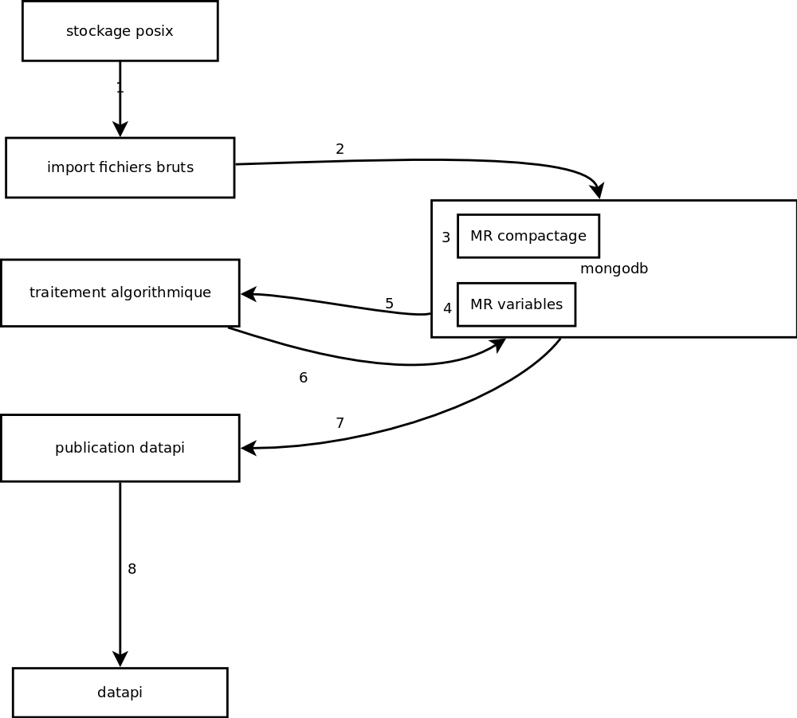

# Architecture logicielle

## Objectifs du dispositif
- récolter les données brutes en provenance des partenaires (goup + stockage POSIX) 
- traiter/importer les données brutes (opensignauxfaibles + mongodb)
- raffiner les données pour obtenir les variables nécessaires à la bonne marche de l'algorithme (opensignauxfaibles + mongodb)
- exécuter la détection algorithmique (opensignauxfaibles + mongodb)
- publier les données à destination des agents (datapi + postgresql + signauxfaibles-web)

## Schéma fonctionnel


### goup
Plus de détails sont disponibles [ici](https://github.com/signaux-faibles/goup)

#### Objectif
goup permet aux partenaires de déposer les fichiers de données brutes sur la plateforme.  
#### Composition
goup est basé sur [tusd](https://github.com/tus/tusd) et lui ajoute des fonctionnalités:
- authentification par JWT
- espaces privatifs par utilisateurs (gestion des droits et des chemins)
- supprime la possibilité de télécharger les fichiers
#### Authentification JWT
En l'absence d'un JWT valide, le service refuse les sollicitations.  
Ce token devra en plus fournir dans son chargement une propriété `goup-path` correspondant au nom d'utilisateur posix ciblé par le versement.  


#### Traitement des fichiers uploadés
- Lors de l'envoi, le fichier n'est accessible qu'au serveur
- La métadonnée `private` associée à l'upload permettra au serveur de décider quel traitement effectuer sur le fichier pour sa mise à disposition.
- Une fois l'envoi complété, le fichier reste disponible dans l'espace du serveur de sorte qu'il pourra naturellement détecté que le fichier est déjà complet et éviter un deuxième envoi.
- Les droits sont fixés sur le fichier pour limiter l'accès aux utilisateurs souhaités (grace à la propriété `goup-path`)
- Un lien est créé dans l'espace de stockage ad-hoc.


#### Structure du stockage
Le fichiers uploadés sont matérialisés sur le disque dur par deux fichiers nommés d'après le hash de l'upload généré par TUS:
- un fichier .bin qui contient les données du fichier
- un fichier .info qui contient les métadonnées

Le stockage est organisé dans 2 répertoires permanents:
- tusd: espace de traitement des upload par le serveur et accessible uniquement par ce dernier
- public: espace commun à tous les utilisateurs

1 répertoire privé pour chaque utilisateur (voir exemple ci-dessous)

Voici l'état du stockage après l'upload de 4 fichiers par deux utilisateurs:
- file1: user1, envoi public
- file2: user1, envoi privé
- file3: user2, envoi public
- file4: user2, envoie privé

```
chemin                           user:group            mode 

.
+-- tusd                         goup:goup             770
|   +-- file1.bin                user1:users           660
|   +-- file1.info               user1:users           660
|   +-- file2.bin                user1:goup            660
|   +-- file2.info               user1:goup            660
|   +-- file3.bin                user2:users           660
|   +-- file3.info               user2:users           660
|   +-- file4.bin                user2:goup            660
|   +-- file4.info               user2:goup            660
+-- public                       user1:users           770
|   +-- file1.bin                user1:users           660
|   +-- file1.info               user1:users           660
|   +-- file3.bin                user2:users           660
|   +-- file3.info               user2:users           660
+-- user1                        user1:goup            770
|   +-- file2.bin                user1:goup            660
|   +-- file2.info               user1:goup            660
+-- user2                        user2:goup            770
|   +-- file4.bin                user2:goup            660
|   +-- file4.info               user2:goup            660
```

#### dépendances logicielles
goup est développé en go (v1.10) et exploite les packages suivants:
- https://github.com/tus/tusd
- https://github.com/tus/tusd/filestore
- https://github.com/appleboy/gin-jwt
- https://github.com/gin-contrib/cors
- https://github.com/gin-gonic/gin
- https://github.com/spf13/viper

### client TUS 
Un exemple de client tus est fourni [ici](https://github.com/signaux-faibles/goup/tree/master/goup-client) et permet de voir une implémentation javascript basée sur le client officiel.  
On trouve toutefois des clients dans de nombreux langages qui permettront aux utilisateurs d'intégrer l'upload de fichier dans leurs plateformes.  

### keycloak
Il s'agit du produit officiel développé par Red-Hat.
KeyCloak fournit les services d'authentification pour `goup` et `datapi` en forgeant les JWT des utilisateurs.

#### Structure du chargement JWT
Deux métadonnées sont utilisées:
- goup-path: ouvre la possibilité de téléverger des fichiers sur goup et désigne l'utilisateur. Il s'agit d'une chaine de caractère
- scope: fixe les attribution de l'utilisateurs au sein de datapi. Il s'agit d'une liste de chaines de caractères.

### opensignauxfaibles
#### Objectif
opensignauxfaibles se charge du traitement des données:
- import des fichiers bruts
- calcul des données d'entrée de l'algorithme
- stockage des résultats

cette brique permet de stocker l'historique des données brutes, mais aussi calculées, ainsi que les résultats de façon offrir une plateforme de travail propice à l'investigation.
#### Modules
##### dbmongo
Ce module est écrit en go (1.10) et centralise les fonctions de traitement des données suivantes:
- analyse des fichiers bruts
- conversion/insert dans mongodb
- ordonnancement des traitements mapreduce/aggregations mongodb
- publication vers datapi

##### module R/H2O
Ce module permet le traitement algorithmique.. (à écrire)

#### Flux de traitement

1. Lecture des fichiers bruts ([dbmongo](#dbmongo))
1. Les données brutes sont converties et insérées dans mongodb ([dbmongo](#dbmongo))
1. Les données sont compactées dans mongodb par un traitement mapReduce
1. Les variables sont calculées dans mongodb par un traitement mapReduce
1. Le traitement algorithmique est effectué par le module [R/H20](#module-rh20)
Pour plus de détail voir [ici](processus-traitement-donnees.md).
### datapi

### signauxfaibles-web

### mongodb

### postgresql

