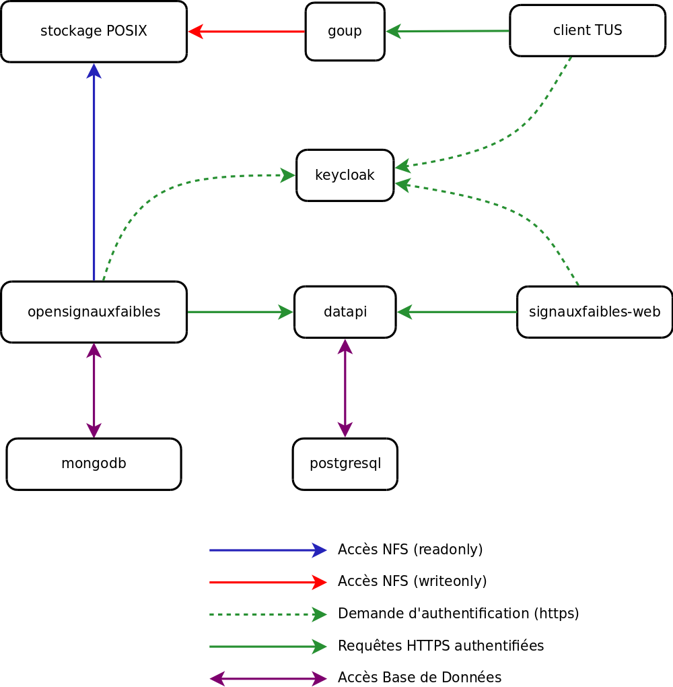

# Architecture logicielle

## Objectifs du dispositif
- récolter les données brutes en provenance des partenaires (goup + stockage POSIX) 
- traiter/importer les données brutes (opensignauxfaibles + mongodb)
- raffiner les données pour obtenir les variables nécessaires à la bonne marche de l'algorithme (opensignauxfaibles + mongodb)
- exécuter la détection algorithmique (opensignauxfaibles + mongodb)
- publier les données à destination des agents (datapi + postgresql + signauxfaibles-web)

## Schéma fonctionnel



### goup
Plus de détails sont disponibles [ici](https://github.com/signaux-faibles/goup)

#### Objectif
goup permet aux partenaires de déposer les fichiers de données brutes sur la plateforme.  
#### Composition
goup est basé sur [tusd](https://github.com/tus/tusd) et lui ajoute des fonctionnalités:
- authentification par JWT
- espaces privatifs par utilisateurs (gestion des droits et des chemins)
- supprime la possibilité de télécharger les fichiers
#### Authentification JWT
En l'absence d'un JWT valide, le service refusera les sollicitations.  
Ce token devra en plus fournir dans son chargement une propriété `goup-path` correspondant au nom d'utilisateur posix ciblé par le versement.  


#### Traitement des fichiers uploadés
- Lors de l'envoi, le fichier n'est accessible qu'au serveur
- La métadonnée `private` associée à l'upload permettra au serveur de décider quel traitement effectuer sur le fichier pour sa mise à disposition.
- Une fois l'envoi complété, le fichier reste disponible dans l'espace du serveur de sorte qu'il pourra naturellement détecté que le fichier est déjà complet et éviter un deuxième envoi.
- Les droits sont fixés sur le fichier pour limiter l'accès aux utilisateurs souhaités (grace à la propriété `goup-path`)
- Un lien est créé dans l'espace de stockage ad-hoc.


#### Structure du stockage
Le fichiers uploadés sont matérialisés sur le disque dur par deux fichiers nommés d'après le hash de l'upload généré par TUS:
- un fichier .bin qui contient les données du fichier
- un fichier .info qui contient les métadonnées

Le stockage est organisé dans 2 répertoires permanents:
- tusd: espace de traitement des upload par le serveur et accessible uniquement par ce dernier
- public: espace commun à tous les utilisateurs

1 répertoire privé pour chaque utilisateur (voir exemple ci-dessous)

Voici l'état du stockage après l'upload de 4 fichiers par deux utilisateurs:
- file1: user1, envoi public
- file2: user1, envoi privé
- file3: user2, envoi public
- file4: user2, envoie privé

```
chemin                           user:group            mode 

.
+-- tusd                         goup:goup             770
|   +-- file1.bin                user1:users           660
|   +-- file1.info               user1:users           660
|   +-- file2.bin                user1:goup            660
|   +-- file2.info               user1:goup            660
|   +-- file3.bin                user2:users           660
|   +-- file3.info               user2:users           660
|   +-- file4.bin                user2:goup            660
|   +-- file4.info               user2:goup            660
+-- public                       user1:users           770
|   +-- file1.bin                user1:users           660
|   +-- file1.info               user1:users           660
|   +-- file3.bin                user2:users           660
|   +-- file3.info               user2:users           660
+-- user1                        user1:goup            770
|   +-- file2.bin                user1:goup            660
|   +-- file2.info               user1:goup            660
+-- user2                        user2:goup            770
|   +-- file4.bin                user2:goup            660
|   +-- file4.info               user2:goup            660
```

#### dépendances logicielles
goup est développé en go (v1.10) et exploite les packages suivants:
- https://github.com/tus/tusd
- https://github.com/tus/tusd/filestore
- https://github.com/appleboy/gin-jwt
- https://github.com/gin-contrib/cors
- https://github.com/gin-gonic/gin
- https://github.com/spf13/viper

### client TUS 
goup respecte le protocole tus en lui 
### opensignauxfaibles
### Stockage POSIX

### datapi

### signauxfaibles-web

### mongodb

### postgresql
