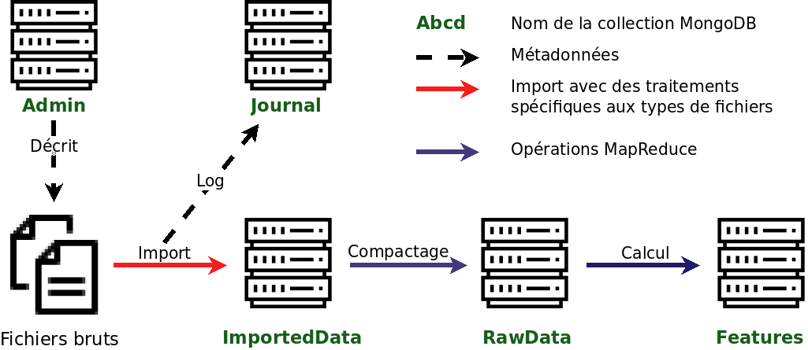

Processus traitement des données
================================

Table of content here TODO

Préambule
---------

Dans cette partie, nous explorons comment sont stockées et transformées les données à  partir des fichiers bruts.

Vue d'ensemble des canaux de transformation des données
-------------------------------------------------------

La base de donneé MongoDB dans laquelle les données sont intégrées est définie dans le fichier config.toml. 

Le schéma ci-dessous montre les différentes étapes de transformation des données. 

L'intégration et le stockage de données se fait par mises-à-jours successives, qu'on appelle "batch". Le parcours de la données est alors à chaque fois identique. 

  __1- Import__

Ce parcours est représenté avec des flêches pleines. Toutes les nouvelles données sont d'abord importées dans une collection RawData à l'aide de fonctions golang spécifiques à chaque type de fichier. La collection Admin définit quels sont les fichiers à intégrer pour chaque "batch". Le processus d'intégration et les potentielles erreurs d'ouverture de fichier, de lecture, ou de conversion sont logués dans la collection Journal. 

Les données ainsi intégrées proviennent de fichiers de différents formats: .csv, .excel, .sas7dbat etc. La façon dont les données sont mises-à-jour peut également être différente, avec des fichiers qui annulent et remplacent, qu'on qualifiera de "fichiers stocks", et des fichiers qui viennent amender, qu'on qualifiera de "fichiers flux". Ceci est configuré dans la collection admin. 

__2- Compactage__

Une fois le batch importées dans la collection RawData, elles vont venir compléter les collections Etablissement et Entreprise, qui comme leur nom l'indique concentrent les informations autour de l'établissement (identifiant: numéro siret) ou de l'entreprise (identifiant: numéro siren). C'est une opération de MapReduce qui est utilisé à cet effet. 

Le processus de compactage consiste à attribuer à chaque objet les nouvelles données qui le concernent, vérifier si ces donneés étaient déjà connues (auquel cas l'objet n'est pas modifié), si les données amendent les informations connues, ou si des informations déjà connues, plus d'actualité, sont à supprimer.

Les collections Etablissement et Entreprise conservent la nature des modifications successives à chaque batch, ce qui rend possible de rétablir chaque objet dans son état après l'intégration de n'importe quel batch. 

__3- Calcul des variables__

Enfin, les données ainsi stockées vont servir au calcul des variables qui alimenteront l'algorithme, stockées dans la collection Features. C'est à nouveau une opération de MapReduce qui permet de fusionner les collections Etablissement et Entreprise et calculer les variables pertinentes. 

## Spécificités de l'import

TODO

## Spécificités du compactage

TODO

## Spécificités des calculs de variables 

TODO
